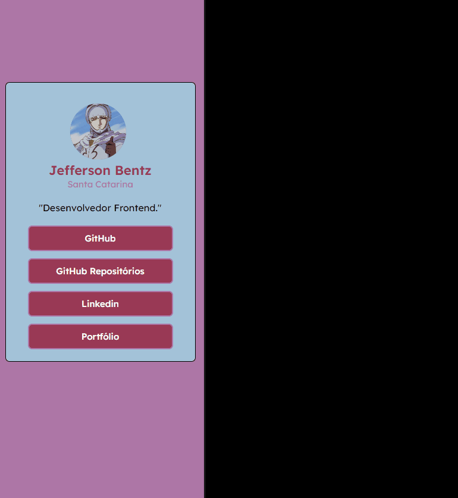

# Link Tree Responsiva

## Link Tree focada no estudo de responsividade

## Tecnologias utilizadas
- HTML
- CSS

## Aprendizados (CSS)
- Melhora na capacidade de ajustar responsividade e layout de páginas

## Dificuldades
- Usar tags mais semânticas 

---
### Projeto Nº2